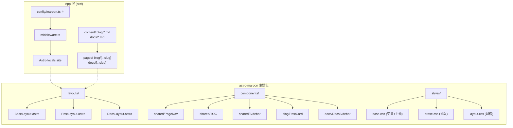
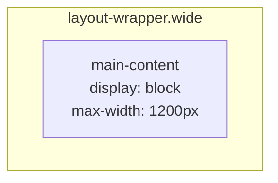
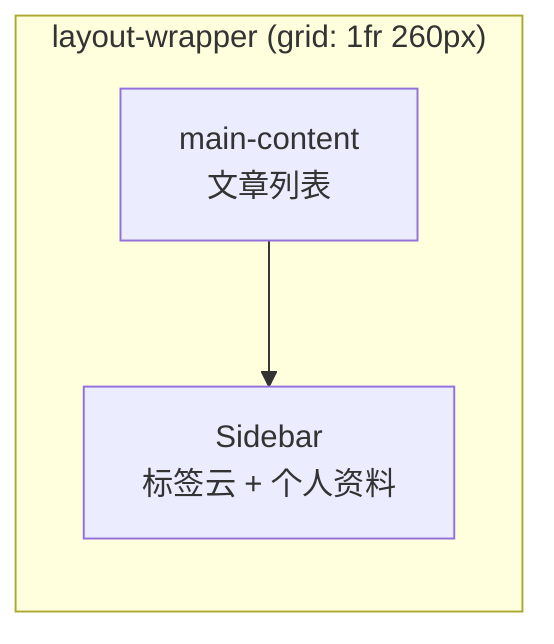
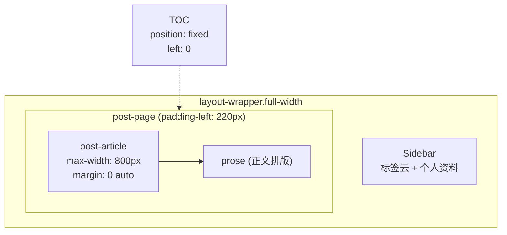
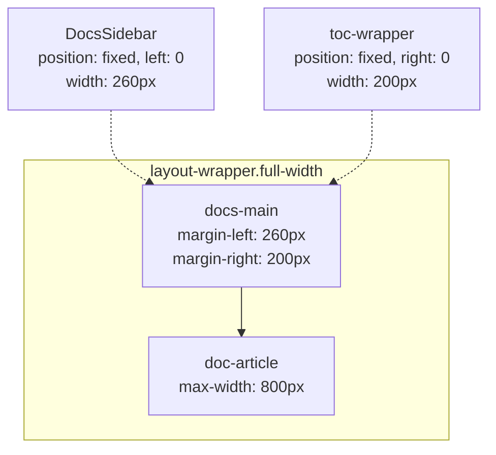

## 项目概述

Maroon 是一个基于 Astro 5 的静态个人博客，支持多主题切换（奶油/星空）、Markdown 内容管理、ViewTransitions 页面过渡动画。包含**博客**和**文档**两大内容板块，以及标签筛选、全文搜索等功能。

- **技术栈**：Astro 5 + TypeScript + CSS Custom Properties
- **Monorepo**：npm workspaces — 主应用 + `astro-maroon` 主题包
- **构建输出**：纯静态 HTML（`output: 'static'`）

---

## 项目结构

```
maroon/
├── packages/
│   └── astro-maroon/            # 独立主题包（可发布到 npm）
│       ├── src/
│       │   ├── components/      # UI 组件
│       │   │   ├── blog/        #   PostCard
│       │   │   ├── docs/        #   DocsSidebar
│       │   │   ├── home/        #   Hero, SeriesCard, SeriesSection
│       │   │   ├── shared/      #   Sidebar, TOC, PageNav
│       │   │   ├── Header.astro / Footer.astro / Search.astro
│       │   ├── layouts/
│       │   │   ├── BaseLayout.astro    # 根布局
│       │   │   ├── PostLayout.astro    # 博客文章
│       │   │   └── DocsLayout.astro    # 文档
│       │   ├── styles/          # CSS 变量、排版、布局
│       │   ├── types/           # SiteConfig, RoutesConfig, PostCardProps...
│       │   └── utils/           # formatDate, generatePath, themes...
│       └── package.json
│
├── src/                         # 主应用 — 胶水层
│   ├── config/
│   │   └── maroon.ts            # ⭐ 唯一配置入口（站点 + 内容类型 + 路由）
│   ├── content/
│   │   ├── blog/ / docs/ / pages/  # Markdown 内容
│   │   └── utils.ts             # 查询工具
│   ├── content.config.ts        # Zod Schema（Astro 强制路径）
│   ├── middleware.ts            # 配置注入 Astro.locals.site
│   └── pages/                   # 路由（极薄胶水层）
├── tsconfig.json                # 路径别名 → 主题包
├── astro.config.mjs
└── package.json                 # workspaces: ["packages/*"]
```

---

## 分层架构



---

## 唯一配置入口：`src/config/maroon.ts`

**新人搭站只需改这一个文件。** 站点信息 + 内容类型 + 路由全部在此配置。

```typescript
// === 内容类型注册 ===
export const contentRegistry: ContentTypeConfig[] = [
  { id: 'blog', label: '博客', route: {...}, layout: 'post', ... },
  { id: 'docs', label: '文档', route: {...}, layout: 'doc', ... },
];

// === 站点信息 ===
export const siteConfig: SiteConfig = {
  title: '栗かな',  author: '栗かな',
  avatar: '/icon.png',  bio: '日语专业 / 技术探索中',
  social: { github: 'https://github.com/Mepuru' },
};
```

### ContentTypeConfig 字段说明

| 字段 | 类型 | 说明 |
|------|------|------|
| `id` | `string` | 对应 `src/content/{id}/` 目录名 |
| `label` | `string` | 显示名称（导航栏、标题） |
| `route` | `{ prefix, pattern }` | URL 路径模板 |
| `layout` | `'post' \| 'doc'` | 使用哪个 Layout |
| `sidebarIncluded` | `boolean` | 详情页是否显示侧边栏 |
| `showInNav` | `boolean?` | 是否出现在导航栏 |
| `hasTags` | `boolean?` | 是否参与标签聚合 |
| `series` | `object?` | 首页系列卡片配置 |

### 自动推导函数

| 函数 | 生成内容 | 消费方 |
|------|---------|--------|
| `generateRoutes()` | `Astro.locals.site.routes` | 所有组件的路径读取 |
| `generateNavItems()` | `siteConfig.nav` | Header 导航栏 |
| `generateSeriesConfigs()` | 系列配置 | 首页 SeriesSection |
| `generateTaggableCollections()` | 带 tags 的 collection ID 列表 | 标签页 |

---

## 数据流

### Middleware 注入链路

```
maroon.ts ──→ middleware.ts ──→ Astro.locals.site ──→ 所有布局/组件自动读取
```

`src/middleware.ts` 在每次请求时合并配置注入：

```typescript
context.locals.site = {
  ...siteConfig,       // 站点信息 + 导航
  themes,              // 主题列表
  defaultTheme,        // 默认主题
  routes: generateRoutes(),  // 路由表
};
```

### Layout 读取优先级

```
props → Astro.locals.site → 硬编码兜底
```

### Astro.locals.site 可用字段

```typescript
{
  title, description, author, avatar, icon, bio,  // 站点信息
  nav: [{ href, label }],                          // 导航栏
  social: { github },                              // 社交链接
  footer: { icp, icpUrl },                         // 备案号
  docs: { emptyTexts },                            // 文档空状态
  themes: [{ id, name }],                          // 主题列表
  defaultTheme,                                    // 默认主题
  routes: { blog, docs, tags, about, home, icon }, // 路由表
}
```

---

## 布局系统

### 普通页面（about / 404 / 列表页）



### 博客列表页（有侧边栏）



### 文章详情页（fullWidth 模式）



### 文档页（fullWidth + 固定侧边栏/TOC）



### 响应式断点

| 宽度 | 博客 | 文档 |
|------|------|------|
| >1200px | TOC fixed 左 + Sidebar 右 | Sidebar fixed 左 + TOC fixed 右 |
| 769–1200px | TOC→悬浮按钮 | TOC→悬浮按钮 |
| ≤768px | 单列 + TOC 按钮 | 侧边栏→抽屉 + TOC 按钮 |

---

## 共享组件

| 组件 | 位置 | 用途 | 用法 |
|------|------|------|------|
| **TOC** | `shared/TOC.astro` | 文章目录，监听滚动高亮 | `<TOC headings={headings} />` |
| **PageNav** | `shared/PageNav.astro` | 上下篇导航 | `<PageNav prev next pattern="/blog/[slug]" />` |
| **Sidebar** | `shared/Sidebar.astro` | 个人资料 + 标签云 | 由 BaseLayout 按需渲染 |
| **PostCard** | `blog/PostCard.astro` | 文章卡片 | `<PostCard title slug pubDate ... />` |
| **DocsSidebar** | `docs/DocsSidebar.astro` | 文档分类导航 | 由 DocsLayout 自动渲染 |

---

## 主题系统

两套预设主题：**奶油（cream）** / **星空（starry）**

通过 CSS 自定义属性 + `data-theme` 属性切换。选择写入 `localStorage`。

### 增加新主题

改主题包的两个文件：

1. `packages/astro-maroon/src/utils/themes.ts` 加 `{ id, name }`
2. `packages/astro-maroon/src/styles/base.css` 加 `[data-theme="xxx"]` 变量块

必须覆盖的 CSS 变量：
`--bg`, `--fg`, `--accent`, `--accent-light`, `--border`, `--muted`, `--card-bg`, `--code-bg`, `--header-bg`, `--search-bg`, `--shadow-*`, `--gradient-*`, `--theme-label`, `--radius-*`

---

## 开发规范

### 命名约定

| 类别 | 规则 | 示例 |
|------|------|------|
| 组件文件 | PascalCase | `Header.astro`, `PostCard.astro` |
| 页面路由 | kebab-case + `[]` | `[...slug].astro`, `[tag].astro` |
| 工具函数 | camelCase | `formatDate()`, `getPublishedPosts()` |
| 类型/接口 | PascalCase | `SiteConfig`, `PostCardProps` |
| CSS 类名 | kebab-case | `.post-card`, `.nav-links` |
| CSS 变量 | kebab-case, `--` 前缀 | `--header-height`, `--font-size-hero-title` |
| 目录名 | kebab-case | `shared/`, `home/`, `blog/` |

### 导入顺序

```astro
---
// 1. Astro 内置
import { getCollection } from 'astro:content';
// 2. 主题包布局/组件
import BaseLayout from 'astro-maroon/layouts/BaseLayout.astro';
// 3. 本地工具
import { buildBlogSidebar } from '../../content/utils';
// 4. 类型
import type { PostCardProps } from 'astro-maroon/types';
// 5. 样式
import 'astro-maroon/styles/layout.css';
---
```

### CSS 规范

- **变量驱动**：禁止在组件样式中硬编码颜色/尺寸，所有主题色在 `base.css` 的 `[data-theme]` 中定义
- **响应式断点**：`≤768px` 手机 / `≤1200px` 平板 / `≥769px` 桌面
- **过渡动画**：主题切换 `0.5s cubic-bezier(0.4, 0, 0.2, 1)`，hover `0.2s ease`
- **区块注释**：用 `/* ==== 区域名 ==== */` 分隔

### TypeScript 规范

- **严格模式** — `astro/tsconfigs/strict`
- **Props 接口** — 优先 `interface`，联合/交叉用 `type`
- **避免 `any`** — 优先 `unknown` + 类型收窄
- **公共类型** — 放在 `packages/astro-maroon/src/types/` 中

---

## 新增内容类型完整流程

以新增"笔记"为例：

### 1. 配置入口

`src/config/maroon.ts` 的 `contentRegistry` 加一条：

```typescript
{
  id: 'notes',
  label: '笔记',
  route: { prefix: '/notes', pattern: '/notes/[slug]' },
  layout: 'post',
  sidebarIncluded: false,
  showInNav: true,
  hasTags: true,
  series: {
    description: '学习笔记',
    countLabel: '篇笔记',
    sortField: 'pubDate',
    sortOrder: 'desc',
  },
}
```

### 2. Zod Schema

`src/content.config.ts` 加 `defineCollection`：

```typescript
const notes = defineCollection({
  loader: glob({ pattern: '**/*.md', base: './src/content/notes' }),
  schema: z.object({ title: z.string(), pubDate: z.coerce.date(), draft: z.boolean().default(false) }),
});
export const collections = { blog, docs, pages, notes };
```

### 3. 内容目录

`src/content/notes/` 下放 `.md` 文件。

### 4. 路由文件

`src/pages/notes/index.astro`（列表页）+ `src/pages/notes/[...slug].astro`（详情页），参照 `src/pages/blog/` 下的文件。

**完成后自动生效**：导航栏出现"笔记"入口、首页出现系列卡片、URL `/notes/xxx` 自动可用。

---

## 工作流

### 本地开发

```bash
npm run dev        # 启动开发服务器（热更新）
npm run build      # 生产构建 + Pagefind 搜索索引
npm run preview    # 预览构建产物
```

### Git 提交

commit message 用中文，前缀标识改动类型：

```
feat:     新功能
fix:      修复问题
refactor: 重构（不改功能）
docs:     文档更新
style:    代码格式清理（不影响逻辑）
chore:    构建配置/工具更新
```

---

## 常见陷阱

### Astro 模板变量

```astro
<!-- ✅ 正确 -->
<a href={blogPrefix}>返回列表</a>
<!-- ❌ 错误 -->
<a href="{blogPrefix}">返回列表</a>
```

### 表格溢出

已通过 `prose.css` 全局修复：
```css
.prose table { display: block; max-width: 100%; overflow-x: auto; }
```

### flex 项溢出

`white-space: nowrap` + `flex: 1` 的容器必须加 `min-width: 0`。

---

## 给后续开发者的规则

1. **每完成一个逻辑阶段后 `git commit`**
2. **不在组件中硬编码路径/文案** — 从 `Astro.locals.site.routes` 读取
3. **新增内容查询用 `src/content/utils.ts` 的工具函数**
4. **所有 `getCollection` 必须包裹 try/catch**
5. **CSS 关键尺寸用变量**（`--sidebar-width`、`--header-height`）
6. **发布前先 `npm run build`** 验证零报错
7. **改代码后同步更新本文档**
